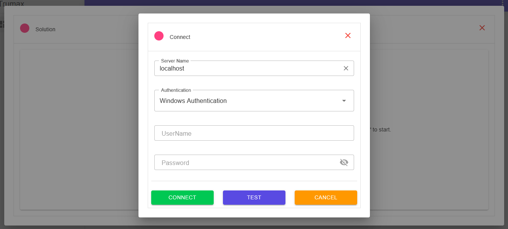

# Trumax — SQL Server Database Manager

Trumax is a lightweight, web-based SQL Server database manager built with **Blazor** and **MudBlazor**. It lets you connect to a SQL Server instance, browse databases/tables/columns in a tree view, run read-only queries, inspect database size, shrink log files, and take full database backups — all from the browser, with no client software to install.

## 📸 Screenshots


## Features

- **Server connection** — connect with either Windows Authentication or SQL Authentication.
- **Schema explorer** — a lazy-loaded tree view of databases → tables → columns, fetched on demand as nodes are expanded.
- **Read-only query editor** — right-click a database → *New Query* to open a query panel and run ad-hoc `SELECT` statements against it, with results shown in a scrollable, sticky-header grid.
- **Database properties** — view data file size, log file size, and total size for a database.
- **Log file shrink** — switch a database to `SIMPLE` recovery, shrink the log file, and switch it back to `FULL`, with the updated size shown immediately.
- **Full database backup & download** — take a full, compressed backup on the server and stream it straight to the browser as a `.zip` download, with a live progress bar, without ever needing direct file-system or network-share access to the SQL Server machine.

## Project Structure

```
Trumax/
├── Trumax.View/                      Razor component library (UI)
│   ├── Components/
│   │   ├── DialogSolution.razor      Main dialog: schema tree + query editor
│   │   ├── DialogConnect.razor       Server connection dialog
│   │   └── DialogProperties.razor    Database properties / shrink log dialog
│   └── ViewModels/                   DTOs shared between client and API
│       ├── Login.cs, SchemaRequest.cs, ShrinkLogRequest.cs, QueryRequest.cs
│       ├── TreeNode.cs, TreeNodeType.cs
│       ├── DatabaseSizeInfo.cs, QueryResult.cs, BackupJobStatus.cs
│       └── Authentication.cs
├── Trumax.Services/
│   └── Controllers/
│       └── SqlServerdbManagerController.cs   All server-side SQL Server logic
└── Trumax.Examples/                  Sample host app (Blazor Web App) wiring it together
```

## How It Works

### Schema browsing

`GetDatabases`, `GetTables`, and `GetColumns` query `sys.databases` and `INFORMATION_SCHEMA` views and feed the `MudTreeView` via its `ServerData` callback, so children are only fetched when a node is expanded.

### Read-only query execution

`ExecuteQuery` enforces read-only access in three layers:

1. **Validation** — the submitted text must start with `SELECT` or `WITH` (for CTEs), must be a single statement (no `;`-separated batches, no `GO`), and must not contain DML/DDL/admin keywords (`INSERT`, `UPDATE`, `DELETE`, `DROP`, `EXEC`, `sp_`, `xp_`, `INTO`, `BACKUP`, …).
2. **Transactional isolation** — the query runs inside a transaction that is **always rolled back**, regardless of outcome, so no change can ever be committed even if the validation layer is bypassed.
3. **Resource limits** — a 30-second command timeout and a 5,000-row cap prevent runaway or oversized queries.

> This is an application-level safeguard, not a substitute for proper SQL Server permissions. For real defense in depth, connect with a login that only has `db_datareader` rights when read-only access is all that's needed.

### Backup & download (no shared storage required)

Because the app server typically has no direct file-system or network-share access to the SQL Server machine, backups are streamed entirely over the existing SQL connection:

1. **`StartBackup`** kicks off a background job. SQL Server's `BACKUP DATABASE` writes to a fixed local folder (`D:\TrumaxDatabaseBackup`, auto-created via `xp_create_subdir`). If the estimated database size exceeds ~1.4 GB, the backup is **striped across multiple files**, because `OPENROWSET(...SINGLE_BLOB)` — used later to read the file back — is capped at 2 GB per value.
2. **`BackupProgress`** is polled by the client every second; percentage is parsed from SQL Server's `STATS` messages via `SqlConnection.InfoMessage`.
3. **`BackupDownload`** reads each backup stripe back through the same SQL connection (`OPENROWSET(BULK ..., SINGLE_BLOB)`) and streams it directly into a `.zip` archive written to the HTTP response body — the full file is never buffered in memory or written to the app server's disk. Temporary files are deleted from the SQL Server machine afterward via `xp_delete_file`.

To restore a striped backup, all parts must be extracted from the zip and referenced together:

```sql
RESTORE DATABASE [MyDb]
FROM DISK = 'part1.bak', DISK = 'part2.bak', DISK = 'part3.bak'
WITH RECOVERY
```

## Requirements

**On the SQL Server instance**, the login used to connect needs:

- `ADMINISTER BULK OPERATIONS` permission (required by `OPENROWSET(...SINGLE_BLOB)`).
- **Ad Hoc Distributed Queries** enabled:
  ```sql
  EXEC sp_configure 'show advanced options', 1; RECONFIGURE;
  EXEC sp_configure 'Ad Hoc Distributed Queries', 1; RECONFIGURE;
  ```
- Write access to `D:\TrumaxDatabaseBackup` (created automatically by the app via `xp_create_subdir`; the SQL Server service account must be able to read and write there).
- `db_backupoperator` (or higher) on databases that will be backed up.

**On the app server (Kestrel)**, synchronous I/O must be allowed for the backup download endpoint, since `ZipArchive` performs a synchronous write when finalizing the archive on `Dispose`. This is enabled per-request inside `BackupDownload` via `IHttpBodyControlFeature`, so no global configuration change is needed.

## Configuration

`appsettings.json`:

```json
{
  "BackupSettings": {
    "TempFolder": "D:\\TrumaxDatabaseBackup"
  }
}
```

## Known Limitations

- Backup job state (`Jobs` / `JobConnections`) is held in an in-memory `ConcurrentDictionary`, so it only works correctly with a single app instance. For multi-instance deployments, move this to a distributed cache (e.g. Redis) or use sticky sessions.
- The `OPENROWSET(...SINGLE_BLOB)` read path caps each backup stripe at ~2 GB; very large databases will produce multiple `.bak` files inside the downloaded `.zip`.
- Query validation uses a keyword blacklist, which is a strong practical safeguard but not a formal SQL parser — for untrusted users, pair it with a restricted, read-only SQL login.
- Taking a backup temporarily switches the database's recovery model to `SIMPLE` and back to `FULL` during log shrink operations, which breaks the log backup chain; take a fresh full/differential backup afterward if point-in-time recovery matters to you.


